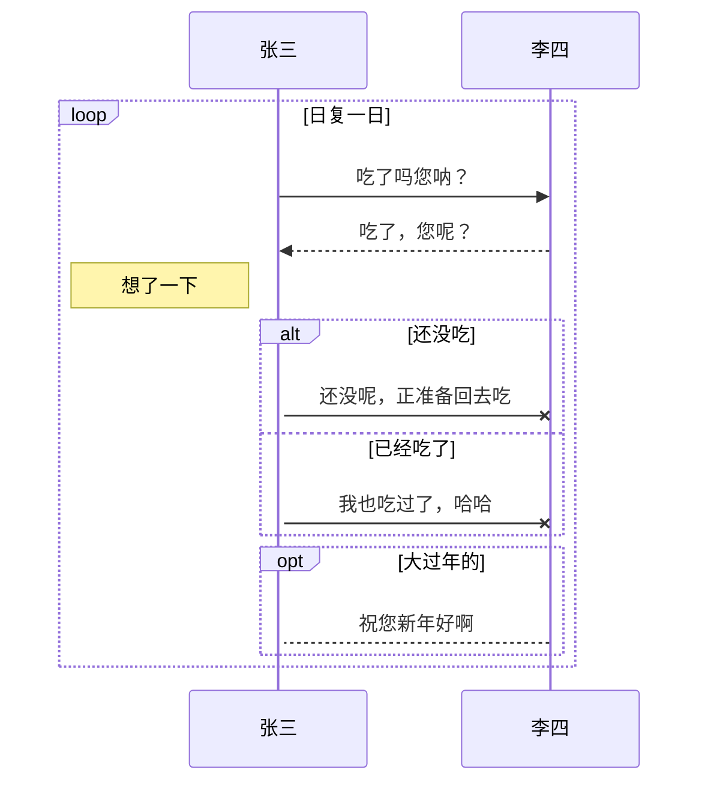

### 反转链表

:::: code-group
::: code-group-item 头插法

```java
class Solution {
    public ListNode reverseList(ListNode head) {
		ListNode p = null;
		while (head != null) {
			ListNode n = head.next;
			head.next = p;
			p = head;
			head = n;
		}
		return p;
    }
}
```

:::
::: code-group-item 递归

```java
class Solution {
    public ListNode reverseList(ListNode head) {
		if(head == null || head.next == null)
			return head;
		ListNode res = reverseList(head.next);
		head.next.next = head;
		head.next = null;
		return res;
    }
}
```

:::
::::

### 队列和栈相互实现

:::: code-group
::: code-group-item 用栈实现队列

```java
class CQueue {
	private Stack<Integer> in;
	private Stack<Integer> out;

	public CQueue() {
		in = new Stack<>();
		out = new Stack<>();
	}

	public void appendTail(int value) {
		in.push(value);
	}

	public int deleteHead() {
		if (out.isEmpty())
			while (!in.isEmpty())
				out.push(in.pop());
		if (out.isEmpty())
			return -1;
		else
			return out.pop();
	}
}
```

:::
::: code-group-item 用队列实现栈

```java
class MyStack {
	private Queue<Integer> que;

	public MyStack() {
		que = new LinkedList<>();
	}

	public void push(int x) {
		que.add(x);
		int size = que.size();
		while (size-- > 1)
			que.add(que.poll());
	}

	public int pop() {
		return que.poll();
	}

	public int top() {
		return que.peek();
	}

	public boolean empty() {
		return que.isEmpty();
	}
}
```

:::
::::

### BFS 模版

:::: code-group
::: code-group-item 树

```java
class Solution {
	public List<List<Integer>> levelOrder(TreeNode root) {
		Queue<TreeNode> queue = new LinkedList<>();
		queue.add(root);
		while (!queue.isEmpty()) {
			int size = queue.size();
			for (int i = 0; i < size; i++) {
				TreeNode node = queue.poll();
				if (node.left != null)
					queue.add(node.left);
				if (node.right != null)
					queue.add(node.right);
			}
		}
	}
}
```

:::
::: code-group-item 图

```java
class Solution {
	int BFS(Node root, Node target) {
		Queue<Node> queue = new LinkedList<>();
		Set<Node> used = new HashSet<>();
		int step = 0; // 根节点到目标节点的路径长
		queue.add(root);
		used.add(root);
		while (!queue.isEmpty()) {
			++step;
			int size = queue.size();
			while (size-- > 0) {
				Node cur = queue.poll();
				if (cur == target)
					return step;
				for (Node next : cur.neighbors) {
					if (!used.contains(next)) {
						queue.add(root);
						used.add(root);
					}
				}
			}
		}
		return -1; // 未找到
	}
}
```

:::
::::

### 单调队列

貌似单调队列的作用常可以用优先队列来替代

```java
class MaxQueue {
	private Queue<Integer> queue;
	private Deque<Integer> deque;

	public MaxQueue() {
		queue = new LinkedList<>();
		deque = new LinkedList<>();
	}

	public int max_value() {
		return deque.isEmpty() ? -1 : deque.peekFirst();
	}

	public void push_back(int value) {
		queue.offer(value);
		while (!deque.isEmpty() && deque.peekLast() < value)
			deque.pollLast();
		deque.offerLast(value);
	}

	public int pop_front() {
		if (queue.isEmpty())
			return -1;
		if (deque.peekFirst().equals(queue.peek()))
			deque.pollFirst();
		return queue.poll();
	}
}
```

### 二叉树模拟隐式栈进行遍历

:::: code-group
::: code-group-item 前序

```java
class Solution {
	public ArrayList<Integer> preorderTraversal(TreeNode root) {
		ArrayList<Integer> res = new ArrayList<>();
		if (root != null) {
			Deque<TreeNode> stack = new LinkedList<>();
			stack.push(root);
			while (!stack.isEmpty()) {
				root = stack.pop();
				res.add(root.val);
				// 右子节点先入栈，以保证出栈为前序
				if (root.right != null)
					stack.push(root.right);
				if (root.left != null)
					stack.push(root.left);
			}
		}
		return res;
	}
}
```

:::
::: code-group-item 中序

```java
class Solution {
	public ArrayList<Integer> inorderTraversal(TreeNode root) {
		ArrayList<Integer> res = new ArrayList<>();
		Deque<TreeNode> stack = new LinkedList<>();
		while (root != null || !stack.isEmpty()) {
			while (root != null) {
				stack.push(root);
				root = root.left;
			}
			root = stack.pop();
			res.add(root.val);
			root = root.right;
		}
		return res;
	}
}
```

:::
::: code-group-item 后序

```java
class Solution {
	public ArrayList<Integer> postorderTraversal(TreeNode root) {
		ArrayList<Integer> res = new ArrayList<>();
		if (root != null) {
			Deque<TreeNode> stack = new LinkedList<>();
			stack.push(root);
			while (!stack.isEmpty()) {
				root = stack.pop();
				res.add(root.val);
				// 需注意令右子节点先出栈
				if (root.left != null)
					stack.push(root.left);
				if (root.right != null)
					stack.push(root.right);
			}
		}
		Collections.reverse(res);
		return res;
	}
}
```

:::
::::

### 图 DFS

:::: code-group
::: code-group-item 隐式栈

```java
class Solution {
	boolean DFS(Node cur, Node target, Set<Node> visited) {
		if (cur == target)
			return true;
		for (Node next : cur.neighbor) {
			if (!visited.contains(next)) {
				visited.add(next);
				boolean result = DFS(next, target, visited);
				if (result)
					return true;
			}
		}
		return false;
	}
}
```

:::
::: code-group-item 模拟调用栈

```java
public class Solution {
	boolean DFS(Node root, int target) {
		Set<Node> visited;
		Stack<Node> stk;
		stk.push(root);
		while (!stk.isEmpty()) {
			Node cur = stk.pop();
			if (cur == target) 
				return true;
			for (Node next : cur.neighbors) {
				if (!visited.contains(next)) {
					stk.push(next);
					visited.add(next);
				}
			}
		}
		return false;
	}
}
```

:::
::::

### 单调栈

单调栈的思想与单调队列类似，即在入栈前将栈内不满足单调性的元素都出栈，确保当前元素入栈后整体保持原有单调性

单调栈的思想不难，但用到它的题一般不简单，在具体运用时经常需要依照实际情况判断栈内到底是存元素值本身还是存其索引

```java
class Solution {
	public void MonotoneStack(int[] nums) {
		Deque<Integer> stk = new ArrayDeque<>();
		for (int num : nums) {
			while (!stk.isEmpty() && stk.peek() < num)
				stk.pop();
			stk.push(num);
		}
	}
}
```

### mermaid 绘图样例


