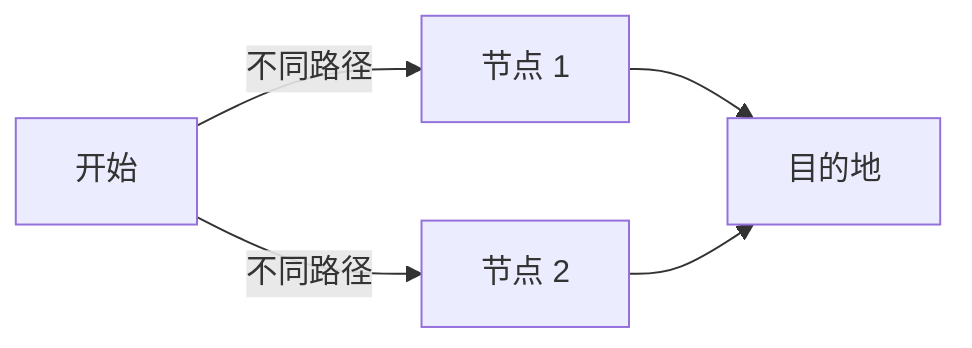

## 说明

此目录下的文章为写作语法参考

## 图表

::: chart 一个玫瑰图案例

```json
{
  "type": "polarArea",
  "data": {
    "labels": ["红色", "绿色", "黄色", "灰色", "蓝色"],
    "datasets": [
      {
        "label": "My First Dataset",
        "data": [11, 16, 7, 3, 14],
        "backgroundColor": [
          "rgb(255, 99, 132)",
          "rgb(75, 192, 192)",
          "rgb(255, 205, 86)",
          "rgb(201, 203, 207)",
          "rgb(54, 162, 235)"
        ]
      }
    ]
  }
}
```

:::

## Mermaid



## 自定义容器

- 类型：`info`, `note`, `tip`, `warning`, `danger`, `details`
- 正常使用时用`:::`标记开头与结尾，嵌套时用`::::`标记外层的

## 对齐

`::: center`, `::: right`

## 卡片

::: card

```card
title: Mr.Hope
desc: Where there is light, there is hope
logo: /logo.svg
link: https://github.com/gragoyd
color: rgba(253, 230, 138, 0.15)
```

```card
title: Mr.Hope
desc: Where there is light, there is hope
logo: https://mrhope.site/logo.svg
link: https://mrhope.site
color: rgba(253, 230, 138, 0.15)
```

:::

## 图片


## 导入文件

可在`.vuepress/config.ts`中配置`pagePatterns`避免 MD 文件被渲染成页面

<!-- @include: ../.vuepress/styles/config.scss-->
